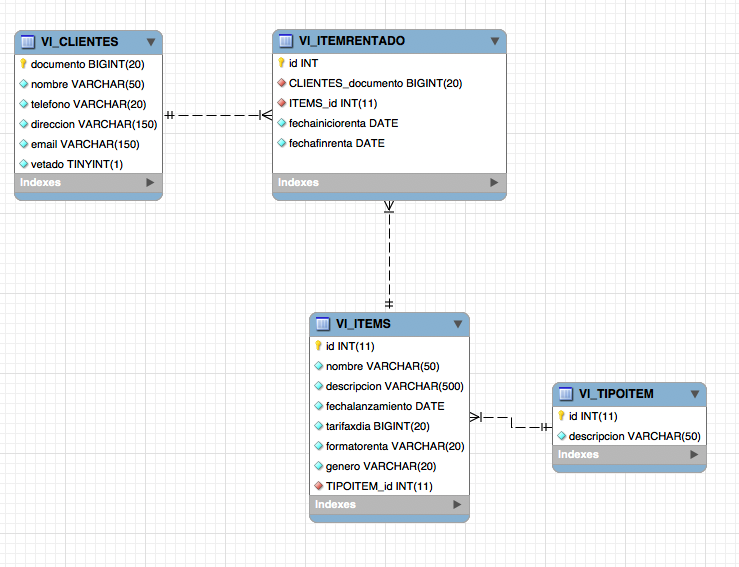

### Escuela Colombiana de Ingeniería
### Procesos de desarrollo de Software - PDSW
#### Tecnologías de persistencia - Frameworks de Persistencia - Introducción a MyBatis


En este laboratorio se utilizará un 'framework' de persistencia. La base de datos que se utilizará tiene los siguientes parámetros:

	host: desarrollo.is.escuelaing.edu.co
	puerto: 3306
	usuario: bdprueba
	pwd: bdprueba
	base de datos: bdprueba



## Parte I (Para entregar en clase)

1. Ubique los archivos de configuración para producción de MyBATIS (mybatis-config.xml). Éste está en la ruta donde normalmente se ubican los archivos de configuración de aplicaciones montadas en Maven (src/main/resources). Edítelos y agregue en éste, después de la sección &lt;settings&gt; los siguientes 'typeAliases':

	```xml
    <typeAliases>
        <typeAlias type='edu.eci.pdsw.samples.entities.Cliente' alias='Cliente'/>
        <typeAlias type='edu.eci.pdsw.samples.entities.Item' alias='Item'/>
        <typeAlias type='edu.eci.pdsw.samples.entities.ItemRentado' alias='ItemRentado'/>
        <typeAlias type='edu.eci.pdsw.samples.entities.TipoItem' alias='TipoItem'/>
    </typeAliases>	
    ```

2. Lo primero que va a hacer es configurar un 'mapper' que permita que el framework reconstruya todos los objetos Cliente con sus detalles (ItemsRentados). Para hacer más eficiente la reconstrucción, la misma se realizará a partir de una sola sentencia SQL que relaciona los Clientes, sus Items Rentados, Los Items asociados a la renta, y el tipo de item. Ejecute esta sentencia en un cliente SQL (en las estaciones Linux está instalado EMMA), y revise qué nombre se le está asignando a cada columna del resultado:

	```sql
		select
        
        c.nombre,
        c.documento,
        c.telefono,
        c.direccion,
        c.email,
        c.vetado,
        
        ir.id ,
        ir.fechainiciorenta ,
        ir.fechafinrenta ,
        
        i.id ,
        i.nombre ,
        i.descripcion ,
        i.fechalanzamiento ,
        i.tarifaxdia ,
        i.formatorenta ,
        i.genero ,        
        ti.id ,
        ti.descripcion 

        
        FROM VI_CLIENTES as c 
        left join VI_ITEMRENTADO as ir on c.documento=ir.CLIENTES_documento 
        left join VI_ITEMS as i on ir.ITEMS_id=i.id 
        left join VI_TIPOITEM as ti on i.TIPOITEM_id=ti.id 
	```

3. Abra el archivo XML en el cual se definirán los parámetros para que MyBatis genere el 'mapper' de Cliente (ClienteMapper.xml). Ahora, mapee un elemento de tipo \<select> al método 'consultarClientes':

	```xml
   <select parameterType="map" id="consultarClientes" resultMap="ClienteResult">
   			SENTENCIA SQL
	</select>
	```

3. Note que el mapeo hecho anteriormente, se indica que los detalles de a qué atributo corresponde cada columna del resultado de la consulta están en un 'resultMap' llamado "ClienteResult". En el XML del mapeo agregue un elemento de tipo &lt;resultMap&gt;, en el cual se defina, para una entidad(clase) en particular, a qué columnas estarán asociadas cada una de sus propiedades (recuerde que propiedad != atributo). La siguiente es un ejemplo del uso de la sintaxis de &lt;resultMap&gt; para la clase Maestro, la cual tiene una relación 'uno a muchos' con la clase DetalleUno y una relación 'uno a uno' con la clase DetalleDos, y donde -a la vez-, DetalleUno tiene una relación 'uno-a-uno- con DetalleDos:

	```xml
    <resultMap type='Maestro' id='MaestroResult'>
        <id property='propiedad1' column='COLUMNA1'/>
        <result property='propiedad2' column='COLUMNA2'/>
        <result property='propiedad3' column='COLUMNA3'/>  
        <association property="propiedad5" javaType="DetalleDos"></association>      
        <collection property='propiedad4' ofType='DetalleUno'></collection>
    </resultMap>

    <resultMap type='DetalleUno' id='DetalleUnoResult'>
        <id property='propiedadx' column='COLUMNAX'/>
        <result property='propiedady' column='COLUMNAY'/>
        <result property='propiedadz' column='COLUMNAZ'/> 
	<association property="propiedadw" javaType="DetalleDos"></association>      
    </resultMap>
    
    <resultMap type='DetalleDos' id='DetalleDosResult'>
        <id property='propiedadr' column='COLUMNAR'/>
        <result property='propiedads' column='COLUMNAS'/>
        <result property='propiedadt' column='COLUMNAT'/>        
    </resultMap>

	```

	Como observa, Para cada propiedad de la clase se agregará un elemento de tipo &lt;result&gt;, el cual, en la propiedad 'property' indicará el nombre de la propiedad, y en la columna 'column' indicará el nombre de la columna de su tabla correspondiente (en la que se hará persistente). En caso de que la columna sea una llave primaria, en lugar de 'result' se usará un elemento de tipo 'id'. Cuando la clase tiene una relación de composición con otra, se agrega un elemento de tipo &lt;association&gt;.Finalmente, observe que si la clase tiene un atributo de tipo colección (List, Set, etc), se agregará un elemento de tipo &lt;collection&gt;, indicando (en la propiedad 'ofType') de qué tipo son los elementos de la colección. En cuanto al indentificador del 'resultMap', como convención se suele utilizar el nombre del tipo de dato concatenado con 'Result' como sufijo.
	
	Teniendo en cuenta lo anterior, haga cuatro 'resultMap': uno para la clase Cliente, otro para la clase ItemRentado, otro para la clase Item, y otro para la clase TipoItem. 

5. Una vez haya hecho lo anterior, es necesario que en el elemento &lt;collection&gt; del maestro se agregue una propiedad que indique cual es el 'resultMap' a través del cual se podrá 'mapear' los elementos contenidos en dicha colección. Para el ejemplo anterior, como la colección contiene elementos de tipo 'Detalle', se agregará el elemento __resultMap__ con el identificador del 'resultMap' de Detalle:

	```xml
	<collection property='propiedad3' ofType='Detalle' resultMap='DetalleResult'></collection>
	```

	Teniendo en cuenta lo anterior, haga los ajustes correspondientes en la configuración para el caso del modelo de Alquiler de películas.

	
7. Si intenta utilizar el 'mapper' tal como está hasta ahora, se puede presentar un problema: qué pasa si las tablas a las que se les hace JOIN tienen nombres de columnas iguales?... Con esto MyBatis no tendría manera de saber a qué atributos corresponde cada una de las columnas. Para resolver esto, si usted hace un query que haga JOIN entre dos o más tablas, siempre ponga un 'alias' con un prefijo el query. Por ejemplo, si se tiene

	```sql	
	select ma.propiedad1, det.propiedad1 ....
	```	

	Se debería cambiar a:

	```sql		
	select ma.propiedad1, det.propiedad1 as detalle_propiedad1
	```

	Y posteriormente, en la 'colección' o en la 'asociación' correspondiente en el 'resultMap', indicar que las propiedades asociadas a ésta serán aquellas que tengan un determinado prefijo:


	```xml
    <resultMap type='Maestro' id='MaestroResult'>
        <id property='propiedad1' column='COLUMNA1'/>
        <result property='propiedad2' column='COLUMNA2'/>
        <result property='propiedad3' column='COLUMNA3'/>        
        <collection property='propiedad4' ofType='Detalle' columnPrefix='detalle_'></collection>
    </resultMap>
	```
	Haga los ajustes necesarios en la consulta y en los 'resultMap' para que no haya inconsistencias de nombres.


8. Use el programa de prueba suministrado (MyBatisExample) para probar cómo a través del 'mapper' generado por MyBatis, se puede consultar un Cliente. 

	```java	
	...
	SqlSessionFactory sessionfact = getSqlSessionFactory();
	SqlSession sqlss = sessionfact.openSession();
	ClientMapper cm=sqlss.getMapper(ClienteMapper.class);
	System.out.println(cm.consultarClientes()));
	...
	```


## Parte II (para el Martes)

1. Configure en el XML correspondiente, la operación consultarCliente(int id) del 'mapper' ClienteMapper.

	En este caso, a diferencia del método anterior (cargar todos), el método asociado al 'mapper' tiene parámetros que se deben usar en la sentencia SQL. Es decir, el parámetro 'id' de  _public Cliente consultarCliente(int id);_ se debe usar en el WHERE de su correspondiente sentencia SQL. Para hacer esto tenga en cuenta:

	* Agregue la anotación @Param a dicho parámetro, asociando a ésta el nombre con el que se referirá en la sentencia SQL:

	```java
		public Cliente consultarCliente(@Param("idcli") int id);
	
	```

	* Al XML (\<select>, \<insert>, etc) asociado al método del mapper, agregue la propiedad _parameterType="map"_ .
	* Una vez hecho esto, podrá hacer referencia dentro de la sentencia SQL a este parámetro a través de: #{idcli}

2. Verifique el funcionamiento haciendo una consulta a través del 'mapper' desde MyBatisExample.

3. Configure en el XML correspondiente, la operación agregarItemRentadoACliente. Verifique el funcionamiento haciendo una consulta a través del 'mapper' desde MyBatisExample.

4. Configure en el XML correspondiente (en este caso ItemMapper.xml) la operación 'insertarItem(Item it). Para este tenga en cuenta:
	* Al igual que en en los dos casos anteriores, el query estará basado en los parámetros ingresados (en este caso, un objeto Item). En este caso, al hacer uso de la anotación @Param, la consulta SQL se podrá componer con los atributos de dicho objeto. Por ejemplo, si al paramétro se le da como nombre ("item"): __insertarItem(@Param("item")Item it)__, en el query se podría usar #{item.id}, #{item.nombre}, #{item.descripcion}, etc. Verifique el funcionamiento haciendo una consulta a través del 'mapper' desde MyBatisExample.
	
5. 	Configure en el XML correspondiente (de nuevo en ItemMapper.xml) las operaciones 'consultarItem(int it) y 'consultarItems()' de ItemMapper. En este caso, tenga adicionalmente en cuenta:
	* Para poder configurar dichas operaciones, se necesita el 'resultMap' definido en ClientMapper. Para evitar tener CODIGO REPETIDO, mueva el resultMap _ItemResult_ de ClienteMapper.xml a ItemMapper.xml. Luego, como dentro de ClienteMapper el resultMap _ItemRentadoResult_ requiere del resultMap antes movido, haga referencia al mismo usando como referencia absoluta en 'namespace' de ItemMapper.xml:

	```xml	
	<resultMap type='ItemRentado' id="ItemRentadoResult">            
		<association ... resultMap='edu.eci.pdsw.sampleprj.dao.mybatis.mappers.ItemMapper.ItemResult'></association> 
	</resultMap>
	```
	
	Verifique el funcionamiento haciendo una consulta a través del 'mapper' desde MyBatisExample.
